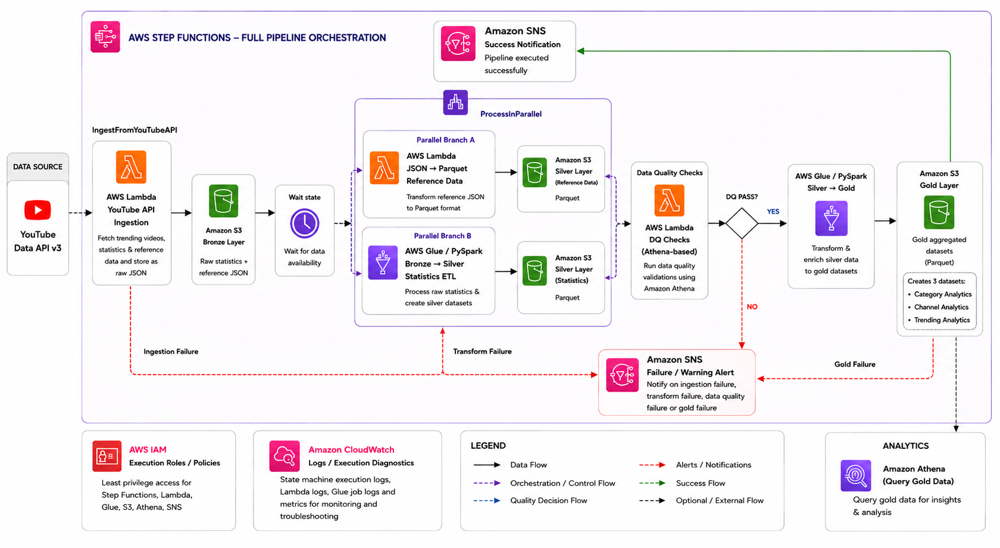
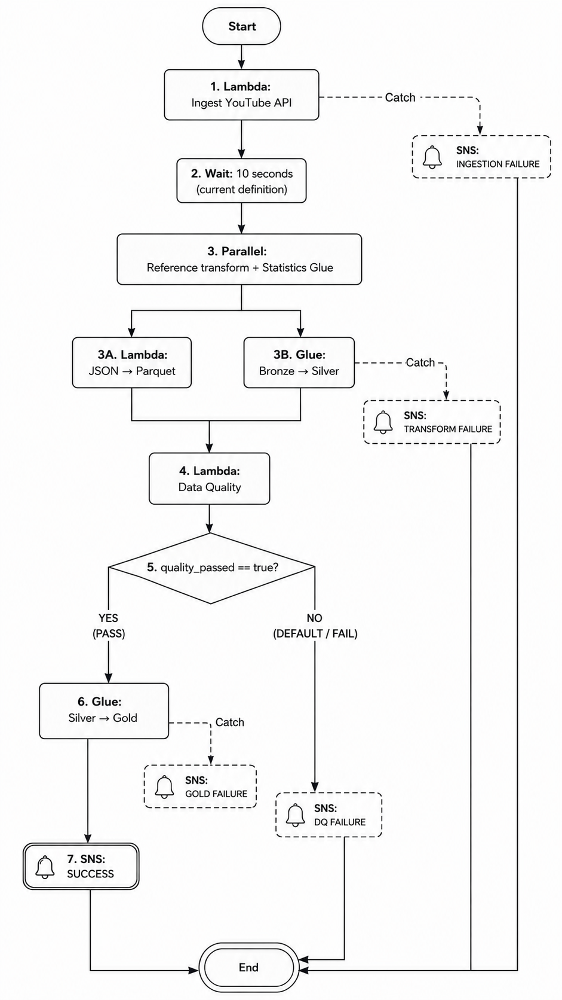

# YouTube Data Engineering Pipeline on AWS

> **AWS Data Engineering Portfolio Project**

An end-to-end AWS data engineering pipeline for ingesting YouTube trending-video data, transforming it through Bronze, Silver, and Gold layers, applying data-quality gates, and exposing curated analytical datasets through Amazon Athena.

The project is centered on the following analytical objective:

> **How does YouTube trending behaviour vary across regions, channels, and content categories, and how can a cloud-native data pipeline support that analysis?**

## Why This Project

This project is designed as a technical case study rather than a collection of isolated AWS service demonstrations. The architecture supports a complete analytical workflow: collect trending data, preserve source-oriented records, standardize and clean the datasets, validate data quality, create analysis-ready Gold datasets, and query those datasets using SQL.

The implementation demonstrates how multiple AWS services can be combined into a coherent data engineering platform with clear separation of storage, transformation, quality validation, orchestration, and analytics responsibilities.

## Architecture



### Core Data Flow

```text
YouTube Data API v3
        ↓
YouTube Ingestion Lambda
        ↓
    S3 Bronze
       ├── Reference JSON → Lambda → S3 Silver
       └── Statistics → Glue / PySpark → S3 Silver
                                      ↓
                               Data Quality Lambda
                                      ├── FAIL → SNS Notification
                                      └── PASS → Glue / PySpark
                                                   ↓
                                                S3 Gold
```

AWS Step Functions orchestrates the end-to-end workflow. Amazon Athena provides analytical access to the Gold datasets, Amazon SNS handles operational notifications, Amazon CloudWatch provides execution logs, and AWS IAM controls service authorization.

## Technology Stack

| Area | Technology |
|---|---|
| Source | YouTube Data API v3 |
| Storage | Amazon S3 |
| Compute | AWS Lambda |
| Distributed ETL | AWS Glue + PySpark |
| Catalog | AWS Glue Data Catalog |
| Orchestration | AWS Step Functions |
| Data Quality | Lambda + Athena-backed checks |
| Analytics | Amazon Athena + SQL |
| Notifications | Amazon SNS |
| Monitoring | Amazon CloudWatch |
| Python Data Tooling | Boto3, Pandas, AWS SDK for Pandas |

## Data Layers

### Bronze

The Bronze layer preserves source-oriented data in Amazon S3. It contains a statistics dataset and a nested category-reference dataset. Historical sample data is organized using region-based prefixes, while the live ingestion Lambda writes API responses using region, date, hour, and ingestion identifiers.

### Silver

The Silver layer contains cleaned and standardized Parquet datasets.

`clean_statistics` is produced by AWS Glue and PySpark. The transformation standardizes data types, parses dates, handles numeric nulls, creates derived metrics, adds processing metadata, and deduplicates records using video, region, and parsed trending date.

`clean_reference_data` is produced by the reference-data Lambda using Pandas and AWS SDK for Pandas. It normalizes the nested `items` array, removes duplicate category IDs, adds processing metadata, and writes region-partitioned Parquet.

### Gold

The Gold transformation creates three analytical datasets:

- `trending_analytics` — regional and daily trending summaries
- `channel_analytics` — channel performance by region
- `category_analytics` — category trends and regional view share

Gold outputs are partitioned by **region**. The date remains available as an analytical column for temporal analysis.

## Data Quality

The Data Quality Lambda validates the Silver datasets using Athena-backed checks before Gold-layer processing. The validation framework covers:

- Minimum row count
- Null percentage for critical columns
- Required-column schema checks
- `views` value-range checks
- Timestamp freshness

The resulting quality report is evaluated by AWS Step Functions. A successful validation allows the workflow to continue to Gold processing, while a failed validation routes the execution to the SNS notification path.

## Orchestration



The Step Functions workflow contains:

1. YouTube ingestion
2. A 10-second wait state
3. Parallel reference-data and statistics processing
4. Data Quality Lambda
5. PASS/FAIL evaluation
6. Gold Glue processing on PASS
7. SNS success/failure notification paths
8. Retry and Catch configuration for selected tasks

## Region Coverage

The ingestion Lambda is configured for the following ten regions by default:

`US, GB, CA, DE, FR, IN, JP, KR, MX, RU`

## Data Dictionary

See [`docs/data-dictionary.md`](docs/data_dictionary.md) for the Bronze, Silver, and Gold schemas, including column definitions, data types, dataset purposes, and partitioning details.

## Analytics

The Gold layer supports analytical questions such as:

1. Which region has the highest aggregate trending-video views?
2. Which channels lead a selected region by views?
3. Which categories contribute the largest share of views?
4. Which categories have the highest average engagement rate?
5. Which channels appear across multiple regions?
6. How does recorded trending-video volume change over time?
7. Is channel-level reach associated with engagement rate?

Example query:

```sql
SELECT
    region,
    SUM(total_views) AS total_views
FROM trending_analytics
GROUP BY region
ORDER BY total_views DESC;
```

Supporting Athena execution screenshots are included as analytical evidence alongside the documented SQL queries.

## IAM and Security

Application permissions are managed through role-based IAM policies. A key implementation detail is the distinction between S3 bucket-level and object-level ARNs:

```text
Bucket-level:  arn:aws:s3:::<BUCKET_NAME>
Object-level:  arn:aws:s3:::<BUCKET_NAME>/*
```

`ListBucket` is a bucket-level action, while object operations such as `GetObject` and `PutObject` use the object ARN.

The repository uses placeholders instead of real API keys, credentials, or private configuration. See [`docs/iam-security.md`](docs/iam_security.md) for the security and permission model.

## Troubleshooting Highlights

### S3 `ListBucket` AccessDenied

An initial policy mapped `s3:ListBucket` to an object ARN. The correction was to grant `ListBucket` on the bucket ARN and object operations on the object ARN.

### Athena Query-Result S3 AccessDenied

The Data Quality Lambda could start Athena queries but required appropriate permissions for the configured S3 query-results location. Athena query execution and query-result access involve both Athena permissions and S3 permissions.

### Step Functions SNS `Publish` AccessDenied

The Step Functions execution role contained a region and resource mismatch for the SNS topic. The correction was applied to the Step Functions execution role.

See [`docs/troubleshooting.md`](docs/troubleshooting.md) for additional details.

## Repository Structure

```text
youtube-data-engineering-pipeline/
│
├── README.md
├── .gitignore
├── LICENSE
│
├── architecture/
│   ├── architecture.png
│   └── orchestration.png
│
├── lambdas/
│   ├── youtube_ingestion/
│   ├── json_to_parquet/
│   └── data_quality/
│
├── glue_jobs/
├── step_functions/
├── scripts/
├── config/
└── docs/
```

## Configuration

Use [`config/config_example.env`](config/config_example.env) as the configuration template. Secrets and credentials should never be committed to Git.

Key configuration parameters include:

- AWS region
- Bronze, Silver, and Gold buckets
- Glue database names
- Athena query-result location
- YouTube API key
- YouTube regions
- SNS topic ARN
- Data-quality thresholds

## Deployment and Reproducibility

The project is implemented through AWS Console configuration together with the source scripts maintained in the repository. Deployment requires creating and configuring the S3 buckets, Glue databases and catalog resources, Lambda functions and IAM roles, SNS topic and subscription, Glue jobs, and Step Functions state machine, followed by supplying the required environment variables and permissions.

The repository includes the application code, configuration templates, documentation, and Step Functions state-machine template while keeping cloud-account credentials and secrets outside source control.

## Running Locally

The local upload helper is a PowerShell script stored at:

```text
scripts/aws_copy_local_s3_rawdata.ps1
```

It expects the historical CSV and category JSON files to be present in the working directory and copies them to the Bronze bucket using the AWS CLI.

## Validation and Evidence

Selected AWS console screenshots, Data Quality execution output, and Athena analytical query results are included in the repository under [`screenshots/`](screenshots/) and [`docs/`](docs/).

The evidence covers the major stages of the pipeline, including ingestion, storage, transformation, data-quality validation, orchestration, analytical querying, and notification configuration.

## Future Enhancements

Potential extensions include:

- EventBridge scheduling
- Configuration-driven multi-region processing
- Stronger incremental and idempotent processing semantics
- More comprehensive data-quality metrics
- Dashboarding
- Automated testing
- Infrastructure-as-code and CI/CD

## References

Technical behavior should be validated against the current AWS and YouTube documentation. Useful official references include:

- AWS Lambda / Step Functions Lambda integration: [AWS Documentation](https://docs.aws.amazon.com/step-functions/latest/dg/connect-lambda.html)
- Amazon S3 consistency: [AWS Documentation](https://docs.aws.amazon.com/AmazonS3/latest/userguide/Welcome.html)
- Amazon Athena query results: [AWS Documentation](https://docs.aws.amazon.com/athena/latest/ug/querying.html)
- Athena `GetQueryResults`: [AWS API Reference](https://docs.aws.amazon.com/athena/latest/APIReference/API_GetQueryResults.html)
- Step Functions SNS integration: [AWS Documentation](https://docs.aws.amazon.com/step-functions/latest/dg/connect-sns.html)
- YouTube Data API v3: [Google Developers Documentation](https://developers.google.com/youtube/v3)
